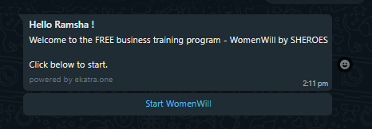
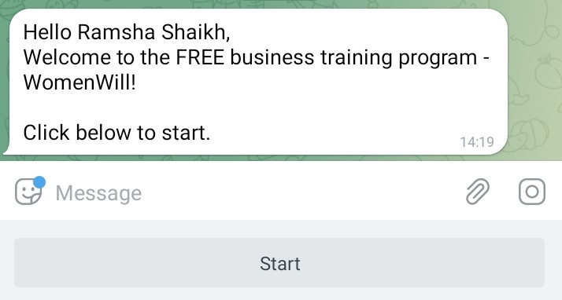

<h1 align="center">Welcome to Schedule Template Messages 👋</h1>

  
  
  <a href="#" target="_blank">
    
    
  
  
  

> **Schedule Template message** is Node.js based cron job program that helps you send schedule messages to users on different channels.
> 
>This repository explains how to send template messages to users daily on WhatsApp & Telegram channels at a specific time.

## Tech Stack
1. [**WhatsApp Business API**](https://www.wati.io/blog/discovering-whatsapp-business-api/#:~:text=WhatsApp%20Business%20API%20enables%20businesses,works%20best%20for%20their%20customers.): 
WhatsApp API was launched to help medium to large companies that wanted to use WhatsApp to communicate with multiple customers at scale. WhatsApp Business API enables businesses to automate communications with automated replies, WhatsApp chatbots & interactive messages.

2. [**node-telegram-bot-api**](https://github.com/yagop/node-telegram-bot-api) : It is Node.js module to interact with the official Telegram Bot API.
  
3. [**Airtable**](https://support.airtable.com/hc/en-us) :  Airtable is an easy-to-use online platform for creating and sharing relational databases.
It is a spreadsheet-database hybrid which lets you create powerful databases that can be used to power custom applications.
Airtable has two APIs:
    * [REST API](https://support.airtable.com/hc/en-us/sections/360009623014-API)
    * [Metadata API](https://airtable.com/api/meta)
    

4. [**Heroku**](https://www.heroku.com/) : Heroku is a container-based cloud Platform as a Service (PaaS). It is used  to deploy, manage, and scale modern apps. 
----
## Prerequisites
1. [WATI Account](https://app.wati.io/register)
2. [Airtable Account](https://airtable.com/signup)
3. [Heroku Account](https://www.heroku.com/)
---
## Initial Steps : Obtain required API Keys and Access Tokens  🔑

A. _WATI Access Token_
1. Login to your WATI account > Go to API Docs.
2. On this page you will find the Access Token, API Endpoint and the available API URLs.
3. Securely store the access token and API Endpoint in .env file

B. *Airtable REST API* 

1. Go to your [account page](https://airtable.com/account)
2. Under API heading in Account Overview page, click **Generate API key button**.
3. Securely save them in your .env file.

C. *Creating new bot with BotFather*
1. Send [@BotFather](https://t.me/botfather) a `/newbot` message
2.	Pick name and username.
3.	Receive a BOT_TOKEN
---
## Let's discuss about our backend - Airtable.
#### Head over to [Airtable Documentation](./docs/Airtable.md) to understand tables schema, field description.

---
## Heroku Add-ons : Advanced Scheduler ⏲
#### *Heroku add-ons* are components that support your application, such as data storage, monitoring, analytics, data processing, and more. These are fully maintained for you by either a third-party provider or by Heroku. 

• Head over to [Heroku Documentation](./docs/Heroku.md) to schedule the template messages.  

---
## WhatsApp Template Message using WATI.
• This application uses WATI as a WhatsApp API solution provider.

• [**WATI**](https://www.wati.io/#) is communication platform built on official WhatsApp API. It has feature such as Shared team inbox, Native integration, sending bulk messages and alot more. 

• Check out the  [WATI API Reference](https://docs.wati.io/reference/post_api-v1-addcontact-whatsappnumber) and play around with the APIs to get a sense of the basics.

Now let's learn how to create a Template Message.

1. Login to your WATI account > Go to *Broadcast*> Click on *Template Messages*
2. Before creating a new Template Message go through the documentation below to learn about Template messages.
  
    [Template Messages Guidelines](https://www.wati.io/blog/create-whatsapp-message-template/)
    
    [Template Messages formatting rules](https://support.wati.io/l/en/article/26656r9knf-what-are-template-formatting-rules)

    [Session messages vs Template Messages](https://support.wati.io/l/en/article/7xk1t99bkq-what-is-the-difference-between-template-message-and-session-message)

-------

## Telegram Template Message

• Creating interactive template messages on Telegram is pretty straightforward.

• We create it with the help of *keyboard reply_markup* option.

• Read about keyboard button: https://github.com/yagop/node-telegram-bot-api/issues/21

---

## Author

👤 **Ramsha Shaikh**

* Twitter: [@ramshaa_shaikh](https://twitter.com/ramshaa_shaikh)
* Github: [@ramshashaikh](https://github.com/ramshashaikh)
* LinkedIn: [@ramsha-shaikh](https://www.linkedin.com/in/ramsha-shaikh/)

## 🤝 Contributing

Contributions, issues and feature requests are welcome! 
If you have any suggestion on how to improve the code create a [PR request](https://github.com/ekatraone/schedule-template-messages/pulls) or faced any issues feel free to [contact me](https://github.com/ekatraone/schedule-template-messages/issues). 

## Show your support

Give a ⭐️ if this project helped you!

## 📝 License

Copyright © 2022 [Ramsha Shaikh](https://github.com/ramshashaikh). 
This project is [MIT](https://github.com/ekatraone/schedule-template-messages/blob/main/LICENSE) licensed.

***
_This README was generated with ❤️ by [readme-md-generator](https://github.com/kefranabg/readme-md-generator)_