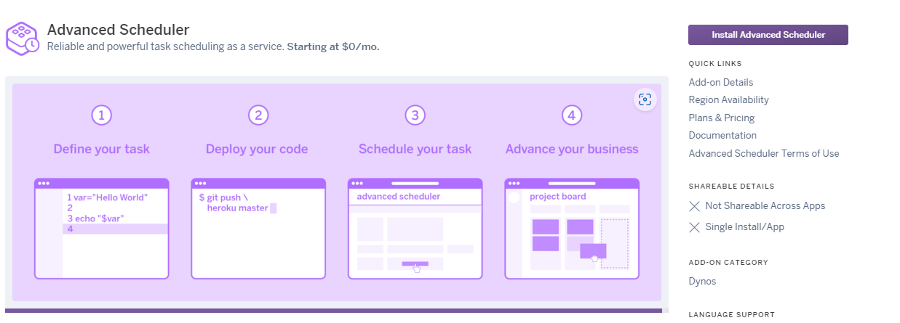
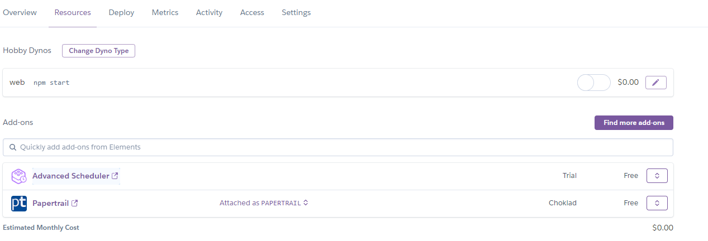
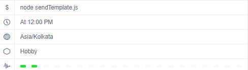
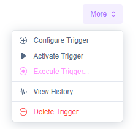

## Step I: Create a new Application.
1. Go to [Heroku Dashboard](https://dashboard.heroku.com/apps) > Click on *New* > Select *Create new app*
2. Enter your application name > Select A*pp Owner* and *Region* > Click *Create App*

3. After you have successfully created your application, it's time to deploy the application.

## Step II: Deploy the code on Heroku.
1. First clone the github repository

  ```sh
  git clone https://github.com/ekatraone/schedule-template-messages.git

  cd schedule-template-messages
  ```

2. Make any changes in the code if needed and publish the code on your github repository. (or you can simply fork this repository) 

3. Go to your heroku application> Go to *Setting*> Click on *Reveal Config Vars*> Add environment variables here.

4. Go to *Resources* > Click on Find more add ons> Search ***Advanced Scheduler*** > Click on Install *Advanced Scheduler*


    🌟*Bonus tip:*
Add Papertail add on: It helps in diagnosing, debugging, troubleshooting, and monitoring your application.

    Know more about [Papertail](https://elements.heroku.com/addons/papertrail)

3. Now we are finally ready to deploy. Go to *Deploy* > There are different options to deploy. The simplest way to deploy is to connect your github repository to Heroku.

4. Your resources page will look like


5. After the deployment is complete. It is time to schedule our template.
---
## Step III: Configure Advanced scheduler.
1. From the *Resources* tab > Click on Advanced Scheduler.
2. Click on *Create Trigger*> Enter Name > Enter command as *node sendTemplate.js* > Select Timezone and Select state as *Active*
3. Select type as *Recurring* since we are sending template daily at a specific time
4. Choose Schedule type as per your choice. For this application we will choose *Schedule helper*
5. Select *unit of time* as Day and select *regular interval* as *Everyday* at *12:00 PM*
6. Click on Save.


7. You can manually trigger the cron job to check if it is running without any errors by going  *More* and click *Execute Trigger*.


And we are done! We have successfully scheduled our template messages. 